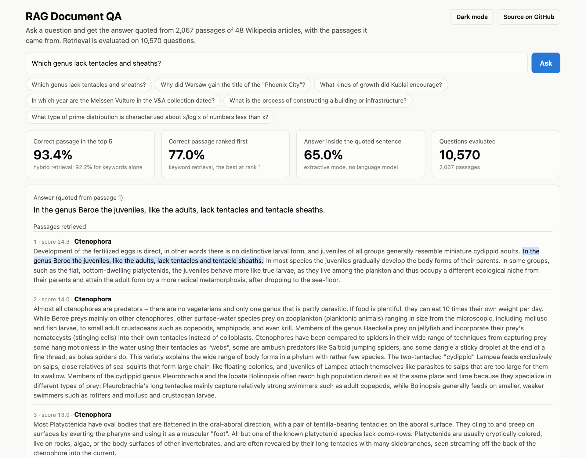
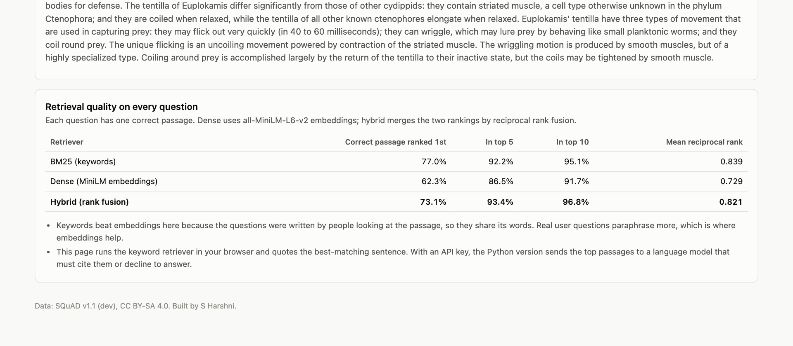

# RAG Document QA


Retrieval-augmented question answering: find the passages that answer a question, then answer from them with citations. Three retrievers are measured on 10,570 questions, so the choice between keywords, embeddings and a hybrid is made on evidence.

**Live demo:** https://s-harshni.github.io/RAG-Document-QA/



## How it works

```
question ──► BM25 (keywords) ────┐
         └─► dense (embeddings) ─┴─► reciprocal rank fusion ──► top 5 passages ──► answer with citations
                                                                                  (LLM API, or quoted sentence)
```

- **BM25** is implemented from scratch over an inverted index ([`retrieval.py`](src/ragqa/retrieval.py)).
- **Dense** retrieval uses `all-MiniLM-L6-v2` sentence embeddings and cosine similarity.
- **Hybrid** merges the two rankings with reciprocal rank fusion.
- **Generation** ([`generation.py`](src/ragqa/generation.py)) sends the numbered passages to a language model through any OpenAI-compatible API. The prompt tells the model to answer only from the passages, cite them like `[2]`, and reply "I cannot answer that from the documents" otherwise. Citations to passages that were not supplied are dropped.
- **Without an API key** the system quotes the sentence that best matches the question, so it still runs end to end. The live demo works this way, with BM25 running in the browser.

## Results

The corpus is the SQuAD v1.1 dev set: 2,067 passages from 48 Wikipedia articles and 10,570 questions, each with one correct passage. Reproduce with `python run.py`.

| Retriever | Correct passage ranked 1st | In top 5 | In top 10 | MRR |
| --- | ---: | ---: | ---: | ---: |
| BM25 (keywords) | **77.0%** | 92.2% | 95.1% | **0.839** |
| Dense (MiniLM embeddings) | 62.3% | 86.5% | 91.7% | 0.729 |
| Hybrid (rank fusion) | 73.1% | **93.4%** | **96.8%** | 0.821 |

- **Hybrid is best where it matters for RAG:** the model reads the top 5 passages, and the correct one is among them for 93.4% of questions.
- **Keywords beat embeddings on this data.** SQuAD questions were written by people looking at the passage, so they reuse its words. Questions from real users paraphrase more, which favours embeddings; that is the reason to keep both.
- **Extractive mode:** the quoted sentence contains a reference answer for 65.0% of questions.
- **Not measured:** the quality of LLM-written answers. That needs a paid API key; the request, prompt and citation parsing are covered by tests with a mocked API.



## Run it

```bash
python -m venv .venv && source .venv/bin/activate
pip install -r requirements.txt
python run.py                                          # evaluates all three retrievers (about two minutes on CPU)
python run.py --ask "Who led the Normans at Hastings?" # one question
pytest -q                                              # 8 tests
python -m http.server -d docs 8000                     # demo at http://localhost:8000
```

To answer with a language model:

```bash
export LLM_API_KEY=...           # any OpenAI-compatible provider
export LLM_BASE_URL=...          # optional, defaults to Nebius AI Studio
export LLM_MODEL=...             # optional
```

## Limitations

- Passages are SQuAD paragraphs, which are already a good size. Real documents need a chunking step, and chunk size changes the results.
- One small embedding model; a larger one or a re-ranker would likely do better.
- The questions share words with their passages, which flatters keyword search.
- Extractive answers are whole sentences, not short spans.

## Data

Rajpurkar, P., Zhang, J., Lopyrev, K., Liang, P. (2016). *SQuAD: 100,000+ Questions for Machine Comprehension of Text.* CC BY-SA 4.0.

## Author

[S Harshni](https://github.com/S-Harshni)
